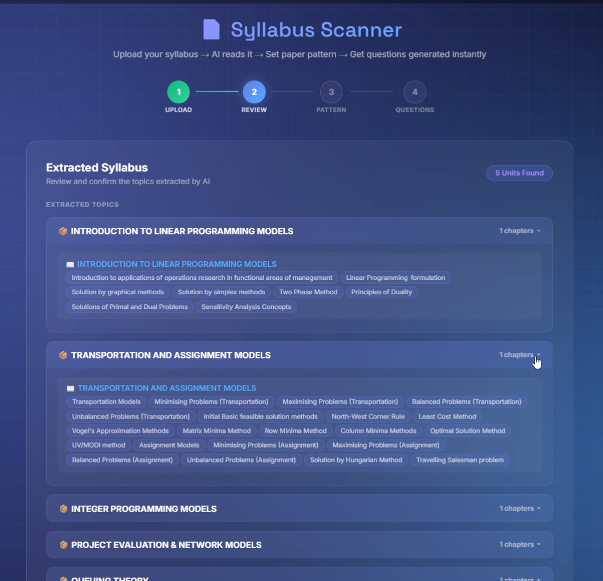
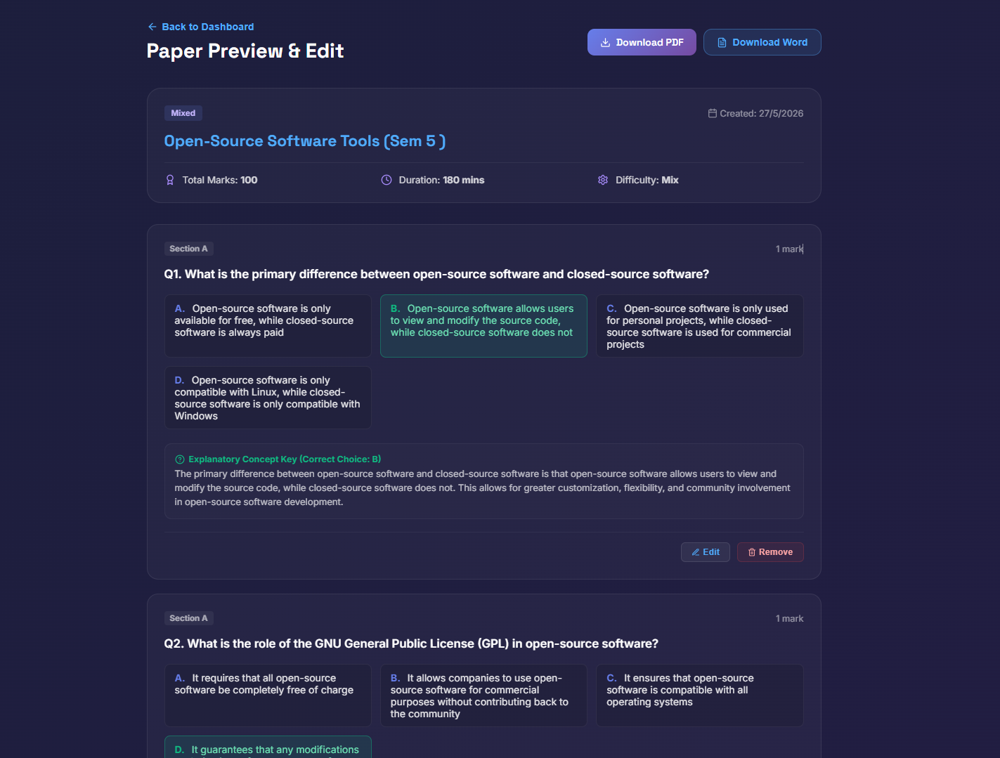
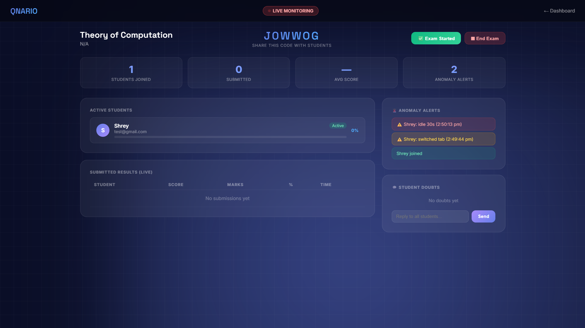
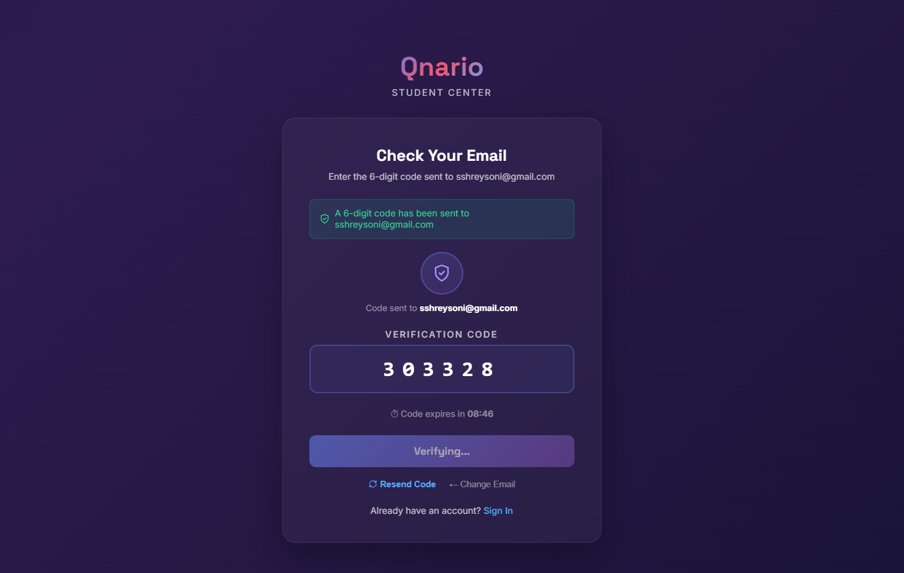
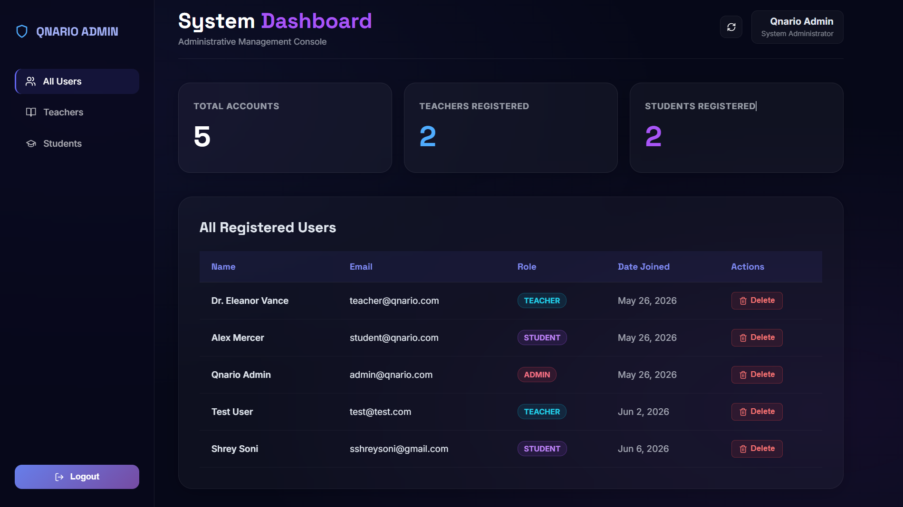
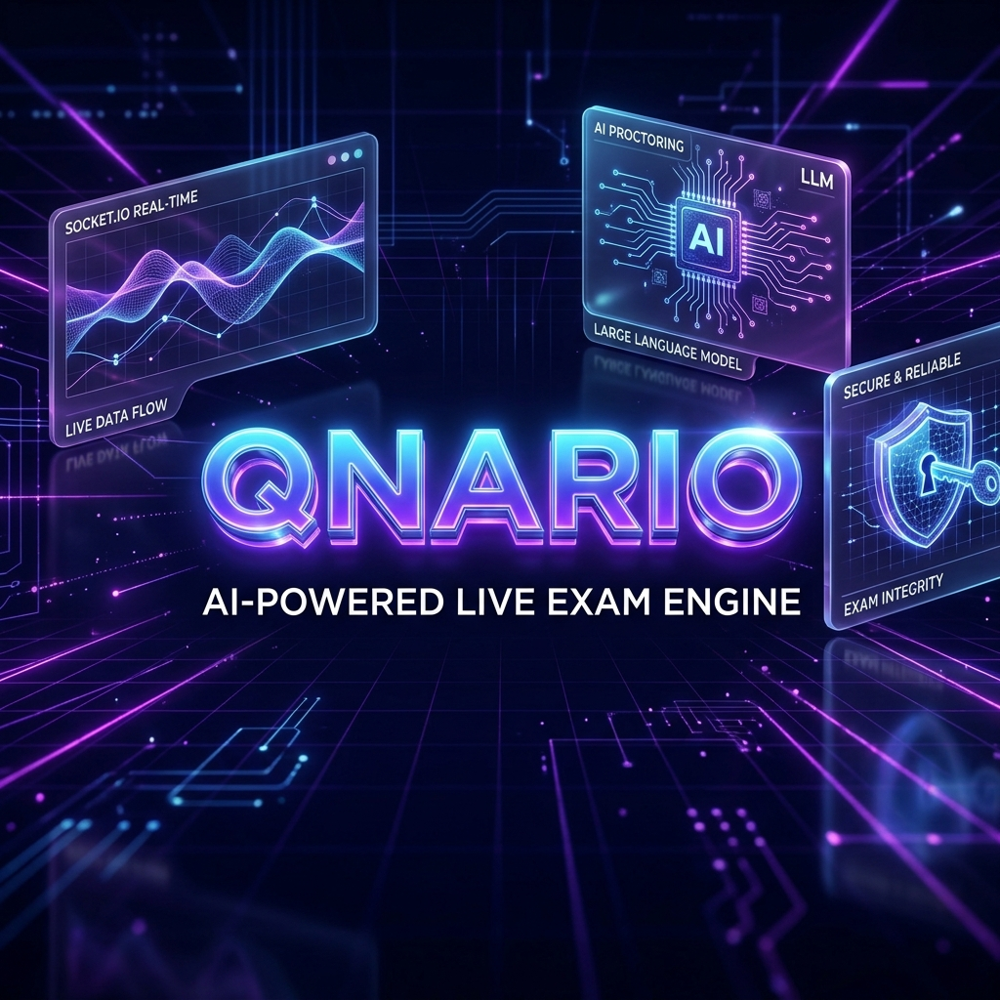

<div align="center">

# 🎓 Qnario
### AI-Powered Exam & Assessment Platform

[](https://nodejs.org)
[](https://reactjs.org)
[](https://python.org)
[](https://fastapi.tiangolo.com)
[](https://mongodb.com)
[](./LICENSE)

**[📺 Demo Video](#) · [🚀 Live Demo](qnario.vercel.app) · [📖 Full Docs](./GUIDE.md)**

---

*Making a question paper used to take hours. With Qnario, a teacher uploads their syllabus, selects the topics they want — and the AI generates a complete, ready-to-use question paper in seconds.*

**This project demonstrates dual-mode AI document processing — full-context prompting for short documents (<8000 tokens), true retrieval-augmented generation (chunking + embeddings + vector search via Chroma) for larger ones — plus an automated eval harness for catching prompt regressions.**

</div>

---

> **The Problem:** Teachers spend enormous time creating question papers from scratch — especially when they want to cover only specific topics or skip chapters not yet taught.
>
> **The Solution:** Upload your syllabus PDF or textbook → AI processes the document (using full-context scanner for short syllabi, or RAG vector indexing via Chroma for large books) → You select exactly what you want → AI builds the progressive question paper stream instantly. Download it, or launch it as a live proctored exam.

## 📸 Screenshots

<!-- 
  🎨 HOW TO UPDATE THESE IMAGES:
  Open your app locally at http://localhost:5173 and take screenshot files.
  Save them into the `./assets/` directory at the project root with the following filenames:
  
  1. For "AI Syllabus Scanner", save as: syllabus-scanner.png  (show the animated scanning loader)
  2. For "Question Paper & Downloads", save as: paper-download-options.png  (⚠️ use TOC syllabus so paper matches the scan)
  3. For "Live Proctoring Monitor", save as: live-proctoring.png  (show countdown timer + student list)
  4. For "2-Step OTP Authentication", save as: login-otp-flow.png  (show login or OTP step)
  5. For "Admin System Dashboard", save as: admin-dashboard.png  (stats grid at /admin)
  6. For "LinkedIn Banner", save as: qnario_linkedin_banner.png  (1584x396 promotional banner)
-->

| AI Syllabus Scanner | Question Paper & Downloads |
|---|---|
|  |  |

| Live Proctoring Monitor | 2-Step OTP Authentication |
|---|---|
|  |  |

| Admin System Dashboard | LinkedIn Banner |
|---|---|
|  |  |

---

## ✨ Key Features

### 📄 Upload Syllabus → Get Question Paper (Core Feature)
This is the heart of Qnario. Designed to **save teachers hours of work**:
1. Teacher uploads their syllabus — **PDF, DOCX, JPG, or PNG**
   - **Multimodal RAG OCR Scanner:** Features smart fallback detection for scanned/image PDFs (e.g. print-to-PDFs), converting files to Base64 data and passing it to Gemini's multimodal engine to perform deep OCR extraction (ensuring topics like "Big-O Notation" are captured).
2. AI automatically reads it and **extracts every unit and topic**
3. Teacher **selects only the topics** they want in the exam (per unit)
   - Each unit has a **"Select All" toggle**
   - A live **"X / Y topics selected"** counter keeps track
   - Great for when some syllabus chapters are not yet taught
4. Click Generate → AI creates a **complete question paper instantly**
5. Teacher can **preview and edit** individual questions
6. **Download** the paper or **launch it as a live exam**

### 🤖 Dual AI Engine
- **Google Gemini** (primary) for high-quality question generation (`gemini-flash-latest` model)
- **Groq LLaMA** (automatic fallback if Gemini quota exceeded)
- **Robust Output Orchestration:** Maximizes generation capacity limits to 8,192 tokens to accommodate the extensive thinking/reasoning phase of modern Gemini models without JSON truncation.
- Supports: **MCQ, Short Answer, Long Answer, True/False**
- Configurable **difficulty**: Easy / Medium / Hard
- Teacher never sees an error — fallback is completely transparent

### 🔴 Live Proctored Exam Rooms *(Bonus Feature)*
- Teacher creates a room → gets a **6-digit code** to share with students
- Students join from any browser (laptop or phone)
- Teacher sees **real-time** list of who joined and who submitted
- **Anti-cheat detection**: Tab switch or focus loss triggers instant alert
- **Student Lockout & Approval Flow**: Students violating proctoring policies (such as tab switches) are automatically locked out, requiring teacher approval/unlock from the Live Monitor to resume.
- **Synchronized Real-time Timer**: Teacher Live Monitor and Student exam room show a fully synchronized, accurate countdown timer.
- **Crash recovery**: Room state saved every 5 seconds — survives restarts
- **Student Exam Recovery (Local Storage)**: Answer drafts are automatically saved to `localStorage` keyed by student email and room code. If the page is refreshed or browser crashes, their progress is instantly recovered upon rejoining the exam and synced back to the teacher's monitor.

### 👤 Student Features & Coding Playground
- Join exam via 6-digit room code
- **AI Coding Practice Hub:** Interactive practice hub across 4 modes:
  - **Code Fill:** Complete empty blanks (`___BLANK___`) inside real, educational code snippets.
  - **Debug Challenges:** Identify code errors, view line-by-line buggy vs fixed code, and select the correct fix.
  - **Trace Output:** Trace loop or memory updates and determine the correct console output.
  - **Concept MCQs:** Test language-specific complexities, time/space complexities, and DSA concepts.
- Supports **multiple languages** (Python, JavaScript, Java, C++, C) and DSA topics.
- Dashboard with score history, dynamic analytics charts, and study streaks.

### 🛡️ Admin Panel
- View all registered users (students & teachers)
- Filter by role, delete accounts with confirmation
- Live count stats

---

## 🏗️ Architecture

```
┌─────────────────────────────────────────────────────────┐
│                    CLIENT (Browser)                     │
│         React 18 + Vite + Socket.io-client              │
│              Port 5173 (dev) / 80 (prod)                │
└────────────────────┬────────────────────────────────────┘
                     │  HTTP + WebSocket
                     ▼
┌─────────────────────────────────────────────────────────┐
│               SERVER (Node.js + Express)                │
│        REST API + Socket.io + JWT Auth + Multer         │
│                      Port 3000                          │
│                         │                               │
│              ┌──────────┴──────────┐                    │
│              ▼                     ▼                    │
│        MongoDB 6+            AI Microservice            │
│     (Users, Exams,      (Python FastAPI, Port 5000)     │
│    Results, Papers)      Gemini API + Groq API          │
└─────────────────────────────────────────────────────────┘
```

---

## 🛠️ Tech Stack

### Frontend
| Technology | Purpose |
|---|---|
| **React 18** | UI Component Framework |
| **Vite 5** | Build Tool + Dev Server + API Proxy |
| **React Router DOM 6** | Client-side Routing + Protected Routes |
| **Axios** | HTTP API Requests |
| **Socket.io-client** | Real-time WebSocket Events |
| **Lucide React** | Icon Library |
| **Recharts** | Data Visualization Charts |
| **jsPDF** | PDF Export |
| **Vanilla CSS** | Custom Design System (Glassmorphism) |

### Backend
| Technology | Purpose |
|---|---|
| **Node.js 20** | JavaScript Runtime |
| **Express.js 4** | REST API Framework |
| **MongoDB + Mongoose 8** | Database + ODM |
| **Socket.io 4** | Real-time Bidirectional Events |
| **JWT (jsonwebtoken)** | Authentication Tokens |
| **bcryptjs** | Password Hashing (salt rounds: 10) |
| **Nodemailer** | Email: OTP, Welcome, Password Reset |
| **Multer** | Syllabus File Upload Handler |
| **pdf-parse + mammoth** | PDF and DOCX Text Extraction |
| **express-rate-limit** | API Abuse Prevention |
| **express-validator** | Input Sanitization & Validation |
| **Helmet** | HTTP Security Headers |
| **cookie-parser** | Secure Cookie Handling |

### AI Microservice
| Technology | Purpose |
|---|---|
| **Python 3.10+** | Runtime |
| **FastAPI** | High-performance Async API Framework |
| **Uvicorn** | ASGI Server |
| **Pydantic v2** | Request/Response Schema Validation |
| **Google Gemini API** | Primary AI — Question Generation & Syllabus Parsing |
| **Groq API (LLaMA)** | Fallback AI when Gemini quota is exceeded |

---

## 📁 Project Structure

```
Qnario/
├── client/                    # React Frontend (Vite)
│   ├── src/
│   │   ├── context/           # AuthContext, SocketContext
│   │   ├── pages/             # All page components
│   │   │   ├── Landing.jsx
│   │   │   ├── Login.jsx      # 2-step OTP signup + login
│   │   │   ├── StudentDashboard.jsx
│   │   │   ├── StudentPractice.jsx
│   │   │   ├── CodingPractice.jsx  # AI coding playground
│   │   │   ├── ExamRoom.jsx   # Live proctored exam
│   │   │   ├── TeacherDashboard.jsx
│   │   │   ├── SyllabusUpload.jsx  # AI syllabus scanner
│   │   │   ├── PaperPreview.jsx
│   │   │   ├── LiveMonitor.jsx     # Real-time teacher view
│   │   │   └── AdminDashboard.jsx
│   │   ├── services/api.js    # All Axios API functions
│   │   └── index.css          # Global design system
│   └── vite.config.js         # Proxy config
│
├── server/                    # Node.js Backend
│   ├── controllers/           # authController, examController
│   ├── models/                # 10 Mongoose schemas
│   ├── routes/                # authRoutes, examRoutes
│   ├── middleware/            # JWT auth, rate limiter
│   ├── socket/                # Socket.io proctoring handlers
│   ├── utils/                 # emailService, seed, docs
│   ├── config/db.js           # MongoDB connection
│   └── server.js              # Entry point
│
├── ai-service/                # Python FastAPI Microservice
│   ├── services/
│   │   └── gemini_service.py  # Gemini + Groq AI engine
│   ├── README.md              # Setup & API Reference
│   ├── main.py                # FastAPI app + endpoints
│   └── config.py
│
└── docker-compose.yml         # Container orchestration
```

---

## 🚀 Quick Start (Local)

### Prerequisites
- Node.js 18+
- Python 3.10+
- MongoDB running locally
- [Gemini API Key](https://aistudio.google.com) (free)
- [Groq API Key](https://console.groq.com) (free)
- Gmail App Password (for email features)

### 1. Clone the repository
```bash
git clone https://github.com/shreysoni1102-cell/Qnario.git
cd Qnario
```

### 2. Set up environment variables

```bash
# Server
cp server/.env.example server/.env
# → Fill in your MongoDB URI, JWT secret, API keys, email

# AI Service
cp ai-service/.env.example ai-service/.env
# → Fill in your Gemini and Groq API keys
```

### 3. Start all 3 services

**Terminal 1 — Backend (Node.js)**
```bash
cd server
npm install
npm run dev
# → Running on http://localhost:3000
```

**Terminal 2 — AI Microservice (Python)**
```bash
cd ai-service
python -m venv .venv
.venv\Scripts\activate      # Windows
# source .venv/bin/activate  # Mac/Linux
pip install -r requirements.txt
uvicorn main:app --host 127.0.0.1 --port 5000 --reload
# → Running on http://localhost:5000
```

**Terminal 3 — Frontend (React)**
```bash
cd client
npm install
npm run dev
# → Running on http://localhost:5173
```

### 4. Open in browser
```
http://localhost:5173
```

---

## 🗄️ Database Schema Overview

| Model | Key Fields |
|---|---|
| `User` | name, email, password (bcrypt), role, isEmailVerified |
| `Question` | text, options[], correctAnswer, subject, topic, difficulty |
| `StudentAttempt` | studentId, examId, answers[], score, submittedAt |
| `StudentResult` | studentId, percentage, grade, AI feedback |
| `Analytics` | studentId, chapterStats, performanceTrend |
| `GeneratedQuestion` | AI-generated Q&A, marks, source topic |

---

## 🔐 Environment Variables

### `server/.env`
```env
PORT=3000
NODE_ENV=development
MONGODB_URI=mongodb://localhost:27017/qnario
JWT_SECRET=your_strong_random_secret_here
JWT_EXPIRES_IN=7d
AI_MICROSERVICE_URL=http://localhost:5000
GROQ_API_KEY=your_groq_key
EMAIL_SERVICE=gmail
EMAIL_USER=your_email@gmail.com
EMAIL_PASSWORD=your_gmail_app_password
FRONTEND_URL=http://localhost:5173
```

### `ai-service/.env`
```env
PYTHON_PORT=5000
GEMINI_API_KEY=your_gemini_api_key
GROQ_API_KEY=your_groq_key
DEBUG=True
```

---

## 🌐 API Reference

### Auth Endpoints (`/api/auth/`)
| Method | Endpoint | Description |
|---|---|---|
| `POST` | `/send-signup-otp` | Send 6-digit OTP to email |
| `POST` | `/signup` | Verify OTP + create account |
| `POST` | `/login` | Authenticate user |
| `POST` | `/logout` | End session (authenticated) |
| `GET` | `/profile` | Get current user profile (authenticated) |
| `POST` | `/forgot-password` | Send password reset email |
| `POST` | `/reset-password` | Set new password using token |
| `POST` | `/admin-login` | Administrative portal login |
| `GET` | `/admin/all-users` | Retrieve all user accounts (Admin Only) |
| `GET` | `/admin/user/:id` | Retrieve single user details (Admin Only) |
| `PUT` | `/admin/user/:id` | Update single user account details (Admin Only) |
| `DELETE` | `/admin/user/:id` | Delete user account (Admin Only) |

### Core Endpoints (`/api/`)
| Method | Endpoint | Description |
|---|---|---|
| **Syllabus Operations** | | |
| `POST` | `/syllabus/upload` | Upload syllabus file (PDF, DOCX, JPG, PNG) |
| `GET` | `/syllabus/list` | Retrieve list of all uploaded syllabi |
| `GET` | `/syllabus/:id` | Retrieve syllabus structure & units |
| `POST` | `/syllabus/:id/generate` | AI-generate question paper from syllabus |
| `GET` | `/syllabus-papers` | List all generated syllabus papers |
| `GET` | `/syllabus-papers/:id` | Retrieve details of specific generated paper |
| `PATCH` | `/syllabus-papers/:id/question/:qNo` | Edit specific question in paper |
| `DELETE` | `/syllabus-papers/:id` | Delete generated syllabus paper (Teacher/Admin Only) |
| **Exam Rooms & Proctoring** | | |
| `POST` | `/exam-room/create` | Create live exam room (Teacher/Admin Only) |
| `GET` | `/exam-room/teacher/reports` | Get history reports of exam rooms (Teacher/Admin Only) |
| `DELETE` | `/exam-room/:code` | Delete exam room report (Teacher/Admin Only) |
| `GET` | `/exam-room/:code` | Get details/status of active exam room |
| `GET` | `/exam-room/:code/paper` | Get question paper for active exam room |
| `POST` | `/exam-room/:code/submit` | Submit student exam room answers |
| **Practice & Results** | | |
| `GET` | `/practice-test` | Get custom practice questions |
| `POST` | `/practice/submit` | Submit practice test answers |
| `GET` | `/results/student/:studentId` | Get all results/attempts for a student |
| `GET` | `/results/:resultId` | Get specific score & AI feedback report |
| `DELETE` | `/results/:id` | Delete student result |
| `GET` | `/dashboard/student/:studentId` | Get student dashboard stats (streaks, trends) |
| **Coding Practice Playground** | | |
| `GET` | `/coding-practice` | Get coding practice tasks (CodeFill, Debug, Trace, ConceptMCQ) |
| `POST` | `/coding-practice/submit` | Submit coding answers for evaluation & explanation |

---

## 🔑 Key Engineering Decisions

**1. Microservice Architecture**
> The AI question generation runs in a separate Python FastAPI process. This isolates heavy AI API calls from the Node.js event loop, so a slow Gemini response never delays real-time Socket.io exam events.

**2. Dual AI Fallback**
> When Gemini's free-tier quota is exhausted, the system automatically switches to Groq (LLaMA-3). Students and teachers never see an error — the fallback is transparent.

**3. OTP-Based Email Verification**
> Registration uses a 2-step flow: collect details → email 6-digit OTP (10-minute TTL) → verify → create account. OTPs are stored in an in-memory Map (no database overhead) and cleared immediately after use.

**4. Crash Recovery for Exam Rooms**
> Active exam room state is written to `exam-rooms.json` every 5 seconds. On server restart, rooms are restored automatically. Students can reconnect using their session token.

**5. Vite Proxy for LAN Access**
> The Vite dev server proxies all `/api` requests to the Node backend. This means the frontend works identically from `localhost`, `192.168.x.x`, or any LAN IP — no hardcoded URLs needed.

**6. Deletion & Administrative Controls**
> Implemented secure, role-restricted deletion flows (`DELETE` requests) for exam rooms, papers, and results, allowing teachers/admins to prune outdated records directly from the UI without database shell access.

**7. Local Storage Student Answer Recovery**
> Implemented active draft saving in `localStorage` keyed by student email and room code. This ensures student answer progress is fully protected against accidental page refreshes, tab closes, or browser crashes, and syncs progress instantly back to the teacher's Live Monitor upon reconnecting.

---

## 🤝 Contributing

This is an academic capstone project. Issues and suggestions are welcome via [GitHub Issues](https://github.com/shreysoni1102-cell/Qnario/issues).

---

## 👨‍💻 Author

<table>
  <tr>
    <td align="center">
      <a href="https://github.com/shreysoni1102-cell">
        <br/>
        <strong>Shrey Soni</strong>
      </a><br/>
      <sub>🏗️ <b>Full Stack, AI & System Design</b></sub><br/><br/>
      <sub>
        • Designed 3-tier microservice architecture (Node.js + Python + React)<br/>
        • Built complete REST API, MongoDB schema & JWT + OTP auth system<br/>
        • Built Python/FastAPI AI microservice with Gemini + Groq fallback<br/>
        • Engineered syllabus parser & question generator (8 question types)<br/>
        • Built real-time live proctoring system with Socket.io<br/>
        • Implemented student lock/unlock, tab-switch detection & timer sync<br/>
        • Designed all UI/UX from scratch — React 18 + Vite<br/>
        • Configured Cloudflare tunnel for LAN & external device access
      </sub>
    </td>
  </tr>
</table>

---

## 🤝 Acknowledgements

Special thanks to the following friends who supported this project:

| | Name | Role |
|---|---|---|
|  | [Maitrik](https://github.com/Maitrik01) | 🧪 Testing & QA — Tested exam flows and reported bugs |
|  | [Grishma](https://github.com/Grishma135) | 🎨 Frontend Support — Assisted in UI/UX styling |
|  | [Vishwa](https://github.com/Vishwachothani) | ⚙️ Backend Support — Helped with API route testing |

---


