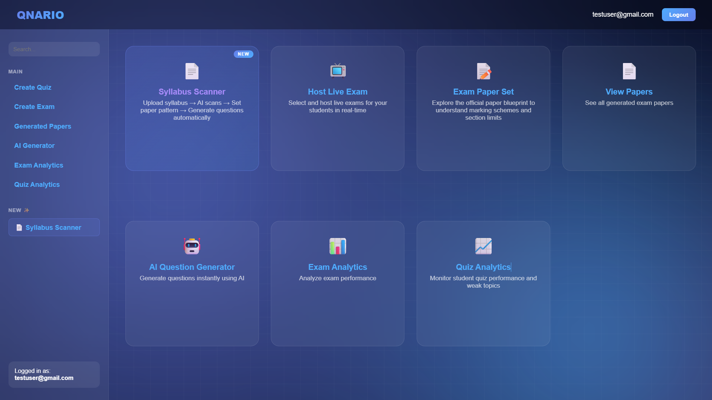

# 🎓 Qnario - Intelligent Exam Management Platform
<p align="center">
  
</p>

---

## 📸 Interface Showcases

<table width="100%">
  <tr>
    <td width="50%">
      <p align="center"><b>🤖 AI Syllabus Scanner</b></p>
      
    </td>
    <td width="50%">
      <p align="center"><b>🛡️ Live Real-time Proctoring</b></p>
      
    </td>
  </tr>
</table>


Qnario is a modern, AI-powered educational platform designed to streamline the examination process. It features real-time live exam monitoring, an intelligent AI microservice capable of extracting topics from syllabus PDFs to generate exam questions, and a fully interactive, role-based dashboard system.

---

## ✨ Key Features

### 👩‍🏫 Teacher Workspace
- **AI Syllabus Scanner:** Upload a syllabus PDF, let AI extract the topics, and generate highly targeted exam questions instantly.
- **Live Exam Hosting:** Create a secure exam room and issue a 6-digit join code to students.
- **Real-Time Proctoring:** Monitor students live using Socket.IO. Receive instant anomaly alerts if a student switches tabs, loses window focus, or stays idle.
- **Live Doubt Chat:** Resolve student queries during the exam via live chat.

### 👨‍🎓 Student Workspace
- **Secure Exam Client:** Join live exams using a generated code. The client tracks focus and enforces strict anti-cheat measures.
- **AI Practice Mode:** Take unlimited mock exams generated by AI.
- **Performance Analytics:** View detailed score cards highlighting strengths and weaknesses by chapter.

### ⚙️ System Architecture & Security
- **Multi-Service Architecture:** A Node.js backend handles heavy routing and real-time sockets, while a dedicated Python Flask microservice processes complex AI tasks (Gemini / Groq LLMs).
- **Crash Resilience:** Live exam rooms are file-backed and auto-synced every 5 seconds. If the server crashes and restarts, rooms and student sessions are instantly recovered.
- **Security Hardened:** Global API rate-limiting (max 200 requests/15 mins) and robust error handling block spam and prevent uncontrolled crashes.

---

## 🏗️ Architecture Diagram

```mermaid
graph TD
    Client[Web Browser Client\nHTML/CSS/JS] -->|HTTP / WebSockets| NodeBackend

    subgraph NodeBackend [Node.js Express Server (Port 3000)]
        Router[API Router]
        Socket[Socket.IO Server]
        RateLimiter[Rate Limiter]
        Persistence[File Persistence\nexam-rooms.json]
    end

    subgraph PythonMicroservice [Python AI Microservice (Port 5000)]
        Flask[Flask API]
        Groq[Groq LLM Engine]
        PDFParser[PDF Extractor]
    end

    Router -->|JSON| Persistence
    Socket -->|Real-time| Client
    Router -->|REST| Flask
    Flask -->|API Calls| Groq
```

---

## 🛠️ Technical Deep-Dive & System Design

To ensure production-grade security, extreme real-time responsiveness, and resilient AI task scheduling, **Qnario** is built using modern system design patterns:

### ⚡ 1. Decoupled Microservice Architecture (Separation of Concerns)
Instead of running monolithic AI generation, the system separates **Input/Output I/O** from **Heavy Computation**:
* **Node.js Gateway Server:** Handles lightweight HTTP routing, serves static UI templates, manages Mongoose database schemas, and maintains persistent WebSockets.
* **Python AI Microservice:** Decoupled entirely on port `5000`. It wraps CPU-heavy PDF extraction, token calculation, and LLM text generation (using **Groq Llama 3** & **Google Gemini**). This guarantees that a sudden spike in teachers scanning syllabus files **never** blocks the real-time WebSocket signals of active exams!

### 🔄 2. State-Persistence & Crash Recovery
Online examinations are highly time-critical. Qnario enforces a **zero-data-loss** philosophy:
* **JSON State Back-Ups:** Active exam rooms, student statuses, chat logs, and anomaly warnings are synced to local disk memory every 5 seconds.
* **State Restoration:** If the Node.js server experiences a crash, power outage, or automatic cloud restart, the entire active state is fully loaded back into server memory. Sockets automatically reconnect using `localStorage` handshake data, restoring the exam session for students within 1.5 seconds.

### 🛡️ 3. Real-Time Anti-Cheat Proctoring (Socket.IO Hub)
The anti-cheat proctoring suite uses low-latency, bidirectional WebSocket events:
* **Focus Anomaly Engine:** Triggers DOM window focus/blur event listeners on the client side. Any focus loss sends an instant socket message to the teacher's monitor.
* **UI Grey-Out Lock:** When the teacher broadcasts a `force_end_exam` event, a global CSS block (`pointer-events: none; opacity: 0.5`) instantly freezes the student's screen, and answers are automatically submitted 1.5 seconds later to prevent page-reload bypassing.

### 🔑 4. Hybrid JWT Security Firewall
Authentication is secured using a modern security pipeline:
* **JWT Signing:** The backend signs cryptographically secure 24-hour tokens upon successful user verification, storing them in client `localStorage`.
* **Token Verification Middleware:** Protects crucial endpoints (like room creation and proctoring channels). 
* **Seamless Fallback:** Wrote a highly adaptive middleware parser that automatically extracts JWT tokens from the `Authorization: Bearer <token>` header, with a legacy header fallback to support offline local testing seamlessly.

---


## 🚀 Setup & Installation

### Prerequisites
- **Node.js** (v18+)
- **Python** (v3.9+)
- **MongoDB** (Running locally on port 27017)

### 1. Configure Environment Variables
Copy `.env.example` in both folders and rename to `.env`, filling in the required keys.
- `/qnario/.env` (Node.js setup)
- `/gemini-microservice/.env` (Python setup, requires `GROQ_API_KEY`)

### 2. Start the AI Microservice (Terminal 1)
```bash
cd gemini-microservice
python -m venv .venv
.venv\Scripts\activate
pip install -r requirements.txt
python app.py
```

### 3. Start the Main Server (Terminal 2)
```bash
cd qnario
npm install
npm start
```
*The server will start on `http://localhost:3000`.*

---

## 📡 Core Technologies

- **Frontend:** Vanilla JavaScript, HTML5, CSS3 (Glassmorphism design)
- **Backend Core:** Node.js, Express.js
- **Real-Time Engine:** Socket.IO
- **Database:** MongoDB (Mongoose) + Local File Persistence
- **AI Microservice:** Python, Flask, Groq API (Llama3-70b), PyPDF2

---

## 🛡️ License & Academic Notice
Developed for capstone project submission. All rights reserved.
