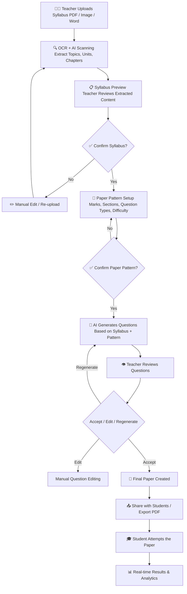

# 📚 AI-Powered Syllabus Scanner & Question Generator — Full Plan

> **Project Idea by the User | Expanded & Structured by Antigravity**

---

## 🧠 Core Concept

> Teacher uploads a **scanned or digital syllabus** → AI reads & understands it → Teacher confirms **paper style & pattern** → AI **generates exam questions** tailored to that syllabus.

---

## 🔁 System Flow (Step-by-Step Logic)



---

## 🗂️ Module Breakdown

### Module 1 — Syllabus Upload & AI Scanning

| Feature | Description |
|---|---|
| **File Upload** | Accept PDF, JPG, PNG, DOCX formats |
| **OCR Engine** | Tesseract.js / Google Vision API for scanned images |
| **AI Parsing** | Gemini AI extracts: Units, Chapters, Topics, Sub-topics |
| **Smart Preview** | Show structured syllabus tree (expandable units/chapters) |
| **Edit Mode** | Teacher can add/remove/rename extracted topics |
| **Save Syllabus** | Store parsed syllabus in DB for future reuse |

---

### Module 2 — Paper Pattern Configuration

| Setting | Options |
|---|---|
| **Paper Type** | Descriptive / MCQ / Mixed / Subjective |
| **Total Marks** | Custom input |
| **Sections** | Section A, B, C with marks per section |
| **Question Types** | MCQ, Fill in Blank, Short Answer, Long Answer, Case Study |
| **Difficulty Level** | Easy / Medium / Hard / Mix |
| **Chapter Selection** | All chapters / Select specific chapters |
| **Bloom's Taxonomy Level** | Remember / Understand / Apply / Analyze / Evaluate / Create |
| **Language** | English / Hindi / Regional |
| **Time Limit** | Set exam duration |

---

### Module 3 — AI Question Generation

- Gemini AI reads the confirmed syllabus + paper pattern
- Generates questions **topic-wise**, mapped to chapters
- Each question tagged with: Chapter name, Difficulty level, Bloom's level, Marks
- Teacher can: ✅ Accept / ✏️ Edit / 🔄 Regenerate / ➕ Add manually
- **Question Bank** auto-saves all generated questions for future use

---

### Module 4 — Real-Time Features 🔴

> [!IMPORTANT]
> These are the features that make this system stand out in daily teaching life.

| Feature | Description |
|---|---|
| **🔴 Live Collaboration** | Multiple teachers co-create a paper in real-time (like Google Docs) |
| **🔔 Real-time Notifications** | Teacher gets notified when paper is viewed/attempted by students |
| **⏱️ Live Exam Monitoring** | See how many students are currently attempting, progress %, time left |
| **📊 Live Result Dashboard** | Results update as students submit — no waiting |
| **💬 In-Paper Doubt Chat** | Students raise doubts during exam; teacher answers live |
| **🚨 Anomaly Alerts** | Alert teacher if student is idle, switches tabs, or exits full-screen |
| **🔄 Auto-Save Paper Draft** | Paper auto-saves every 30 sec while creating |
| **📡 Offline + Sync** | If internet drops, answers saved locally and synced on reconnect |

---

### Module 5 — Student Experience

| Feature | Benefit |
|---|---|
| **📥 Receive Paper via Code** | Join exam with unique room code |
| **🎯 Topic-wise Questions** | Students know which chapter each question is from |
| **⏳ Timer with Warning** | Countdown with alerts at 10 min, 5 min, 1 min |
| **📤 Auto-Submit** | Paper auto-submits when time runs out |
| **📈 Instant Result Card** | Chapter-wise score breakdown after submission |
| **🔁 Reattempt Mode** | Teacher can allow reattempt for practice |
| **📚 Weak Topic Suggestions** | AI recommends topics to revise based on mistakes |
| **🏆 Leaderboard** | Optional class leaderboard for motivation |

---

## 🎓 Benefits for Teachers

> [!TIP]
> This system saves **2–5 hours per exam paper** for a teacher.

- ✅ **Zero manual typing** — AI generates questions from uploaded syllabus
- ⏱️ **Time-saving** — Paper ready in minutes, not hours
- 📁 **Reusable Question Bank** — Previously generated questions stored forever
- 🧩 **Custom Paper Patterns** — Works for any school/college exam format
- 📊 **Smart Analytics** — Know which chapter students struggle with most
- 👥 **Collaboration** — Co-create papers with other subject teachers
- 📄 **One-click PDF Export** — Print-ready or share digitally
- 🔄 **Re-generate Specific Questions** — Don't like a question? Swap it instantly

---

## 🎒 Benefits for Students

- 📖 **Syllabus Transparency** — Students know exactly what's covered
- ⚡ **Instant Results** — No waiting days for corrections
- 📊 **Personalized Weak Area Report** — e.g., "You scored 2/10 in Chapter 3 — Algebra"
- 🧠 **AI Study Suggestions** — AI recommends what to revise before next test
- 🔁 **Practice Mode** — Attempt past papers for self-study
- 📱 **Mobile Friendly** — Attempt from phone/tablet anywhere
- 🏅 **Progress Tracking** — Track improvement over multiple tests

---

## 🛠️ Recommended Tech Stack

| Layer | Technology |
|---|---|
| **Frontend** | HTML + CSS + Vanilla JS |
| **Backend** | Node.js + Express.js |
| **AI Engine** | Gemini API (already in your project!) |
| **OCR** | Tesseract.js (free) or Google Vision API |
| **Database** | MongoDB |
| **Real-time** | Socket.IO |
| **File Storage** | Multer + Local / Firebase Storage |
| **PDF Export** | jsPDF / Puppeteer |
| **Auth** | JWT-based (teacher/student role separation) |

---

## 📐 Database Schema (High-Level)

```
Syllabus
  ├── id, teacherId, subject, class, uploadedFile
  ├── extractedTopics: [ { unit, chapter, topics[] } ]
  └── createdAt

PaperPattern
  ├── id, syllabusId, teacherId
  ├── sections: [ { name, marks, questionType, difficulty } ]
  └── totalMarks, duration, language

GeneratedPaper
  ├── id, patternId, syllabusId
  ├── questions: [ { text, type, marks, difficulty, chapter, options[], answer } ]
  ├── status: draft | published | archived
  └── roomCode (for student access)

ExamAttempt
  ├── id, paperId, studentId, startTime, endTime
  ├── answers: [ { questionId, selectedAnswer, isCorrect } ]
  └── score, chapterWiseBreakdown

QuestionBank
  ├── teacherId, subject, chapter
  ├── questions[], usageCount
```

---

## 🚀 Suggested Feature Phases

### Phase 1 — Core MVP
- Syllabus upload (PDF/Image)
- AI scanning & topic extraction
- Paper pattern setup
- AI question generation
- Teacher review & edit

### Phase 2 — Real-Time & Student Side
- Student exam room with room code
- Live timer and auto-submit
- Real-time result dashboard (Socket.IO)
- Instant result card for students

### Phase 3 — Analytics & Intelligence
- Chapter-wise performance analytics
- Weak topic suggestions (AI)
- Question bank with search & filter
- PDF export of paper + answer key

### Phase 4 — Advanced
- Live collaboration (multi-teacher paper editing)
- AI anti-cheating alerts (tab switch, idle detection)
- Practice mode for students
- School/College admin dashboard

---

## 💡 Unique Selling Points

> [!NOTE]
> Most existing tools either scan OR generate. Your idea combines **scanning + confirmation + generation in one intelligent flow** — that's the differentiator.

1. **Syllabus-Grounded Questions** — Not random AI questions, but *syllabus-specific*
2. **Teacher has full control** — Confirm at every step before finalizing
3. **End-to-end** — From syllabus upload to student result in one platform
4. **Real-time** — Live monitoring, live results, live collaboration
5. **Reusable** — Question bank grows smarter with every use
6. **Offline-ready** — Works even with poor connectivity

---

*Plan prepared for the Qnario project | April 2026*
